# FurniSpace FE - Tong quan trang, chuc nang va flow he thong

Cap nhat theo code frontend hien tai ngay 2026-08-03.

Tai lieu nay dung de nguoi phu trach du an nam duoc frontend FurniSpace dang co nhung gi, moi nhom nguoi dung van hanh ra sao, cac trang nao dang ton tai, va luong nghiep vu chinh di qua nhung man hinh nao. Tai lieu dua tren route trong `src/app/App.tsx`, navigation/sidebar tung role, React Query hooks va cac tai lieu handoff trong thu muc `doc/`, `docs/`.

## 1. Muc tieu he thong FE

FurniSpace FE la ung dung web cho quy trinh thiet ke - tu van - san xuat noi that. He thong chia thanh cac workspace theo vai tro:

| Vai tro | Muc dich chinh |
| --- | --- |
| Public/Guest | Xem trang gioi thieu, san pham, du an mau, dang ky/dang nhap |
| Customer | Tao yeu cau du an, theo doi tien do, xem proposal/quotation/order, thanh toan, chat |
| Sale | Tiep nhan request, lam viec voi customer, tao lich, quotation, order/payment |
| Designer | Nhan project, tao proposal, dung room planner/3D, publish phuong an, xu ly customization |
| Production | Review yeu cau customization, quan ly yeu cau san xuat, task, issue, giao hang |
| Admin | Quan tri user, category, product, model/file, project, report |

## 2. Tong quan route va bao ve quyen

Frontend dung React Router va `ProtectedRoute`.

- Public route co the truy cap khong can role: `/`, `/login`, `/register`, `/forgot-password`, `/code-verify`, `/products`, `/projects`, mot so route 3D demo.
- Protected route goi `useCurrentUser()` de lay thong tin user hien tai.
- Neu khong co user hoac role khong hop le, FE redirect ve `/`.
- Sau dang nhap, `getPostLoginPath(role)` dieu huong:

| Role | Trang vao sau dang nhap |
| --- | --- |
| ADMIN | `/admin/dashbroad` |
| SALE | `/sale/dashbroad` redirect ve `/sales/dashbroad` |
| DESIGNER | `/designer/assigned-projects` |
| PRODUCTION | `/production/customization-requests` |
| CUSTOMER | `/customer/dashboard` |

Ghi chu hien trang: `App.tsx` dang co nhieu route bi khai bao trung lap. Mot so route cua customer/admin/sale/designer duoc khai bao trong `ProtectedRoute`, sau do lai xuat hien ben duoi ngoai guard. Can ra soat lai de tranh bypass role protection va lam route map gon hon.

## 3. Luong tong the cua he thong

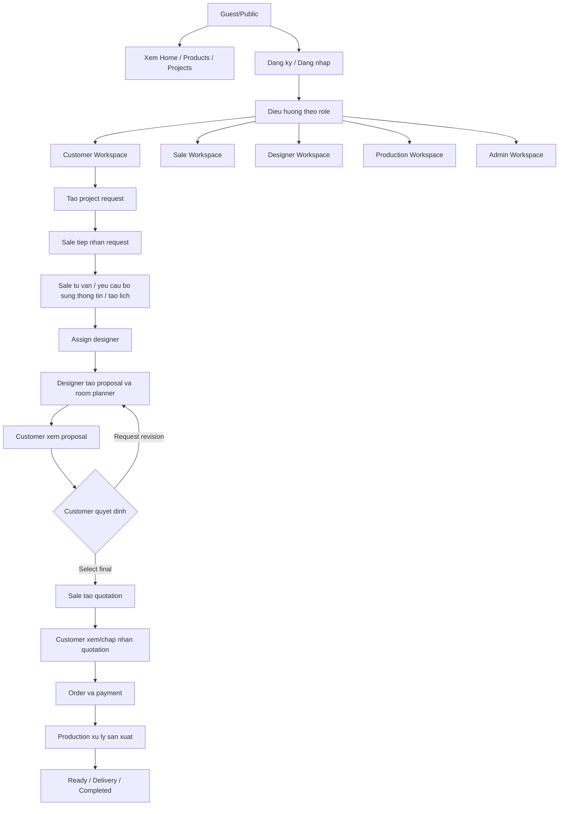

## 4. Public va Auth pages

| Route | Trang | Chuc nang hien co |
| --- | --- | --- |
| `/` | HomePage | Trang public gioi thieu FurniSpace, dieu huong den products/projects/login/register |
| `/products` | ProductListPreviewPage | Xem danh sach san pham preview, category/product cards |
| `/products/detail` | ProductDetailPage | Xem chi tiet san pham public |
| `/projects` | ProjectListReviewPage | Xem danh sach du an mau/review |
| `/projects/detail` | ProjectDetailPage | Xem chi tiet du an mau |
| `/login` | LoginPage | Dang nhap, luu token, redirect theo role |
| `/register` | RegisterPage | Dang ky tai khoan |
| `/code-verify` | CodeVerifyPage | Xac thuc ma sau dang ky/quen mat khau |
| `/forgot-password` | ForgotPasswordPage | Khoi phuc mat khau |
| `/user-profile` | UserProfilePage | Trang thong tin nguoi dung, hien dang public trong route |
| `/viewer3d`, `/3d-lab`, `/3d-building-test` | Viewer/3D test pages | Trang demo/test 3D, room planner/building planner |

Nghiep vu public:

- Guest xem san pham/du an de tham khao.
- Guest dang ky/dang nhap de vao workspace theo vai tro.
- Navbar public co doi ngon ngu, profile/account menu khi co token.

## 5. Customer workspace

Customer la nguoi tao yeu cau va theo doi toan bo qua trinh tu tu van den thanh toan/giao hang.

### 5.1 Navigation customer

| Menu | Route | Vai tro |
| --- | --- | --- |
| Home | `/customer/dashboard` | Tong quan tinh trang cua customer |
| My Projects | `/customer/projects` | Danh sach project cua customer |
| Tracking | `/customer/tracking` | Theo doi tien do |
| Quotations | `/customer/quotations` | Xem va xu ly quotation |
| Orders | `/customer/orders` | Xem order, payment, giao hang |
| Schedules | `/customer/schedules` | Xem/xac nhan lich |
| Project Chat | `/customer/chat` | Chat theo project |
| Create Project Request | `/customer/project-request` | Tao request moi |

### 5.2 Chi tiet trang customer

| Route | Trang | Chuc nang chinh |
| --- | --- | --- |
| `/customer/dashboard` | CustomerDashboardPage | Tong quan project, timeline, trang thai, loi tat den request/projects/schedules/chat |
| `/customer/project-request` | CustomerProjectRequestPage | Tao project moi, nhap thong tin co ban, nhu cau, khong gian, ngan sach, upload file neu co |
| `/customer/projects` | CustomerProjectListPage | Xem danh sach project cua minh, loc/truy cap project dang xu ly |
| `/customer/projects/:projectId/edit` | CustomerProjectInformationPage | Bo sung/cap nhat thong tin project khi Sale yeu cau `NEED_BASIC_INFORMATION` |
| `/customer/tracking` | Tracking | Theo doi tien do san xuat/giao hang theo project/order |
| `/customer/schedules` | CustomerSchedulesPage | Xem lich hen, xac nhan lich dang cho confirm |
| `/customer/proposals` | CustomerProposalDetailPage | Xem proposal da publish, so sanh phuong an, request revision, select final |
| `/customer/proposals/:proposalId` | CustomerProposalDetailPage | Xem chi tiet proposal cu the |
| `/customer/quotations` | CustomerQuotationsPage | Xem quotation, chap nhan/tu choi/yeu cau chinh sua tuy trang thai |
| `/customer/orders` | CustomerOrdersPage | Xem order, tien coc/con lai, tao/kiem tra payment, theo doi delivery |
| `/customer/projects/:projectId/feedback` | ProjectFeedback | Gui feedback sau qua trinh lam viec/giao hang |
| `/customer/3d-preview` | Customer3dPreviewPage | Xem preview 3D cua proposal/scene |
| `/customer/chat` | CustomerChatPage | Chat text/file voi sale/designer trong project |
| `/customer/profile` | UserProfilePage | Xem/cap nhat thong tin ca nhan |

### 5.3 Flow customer

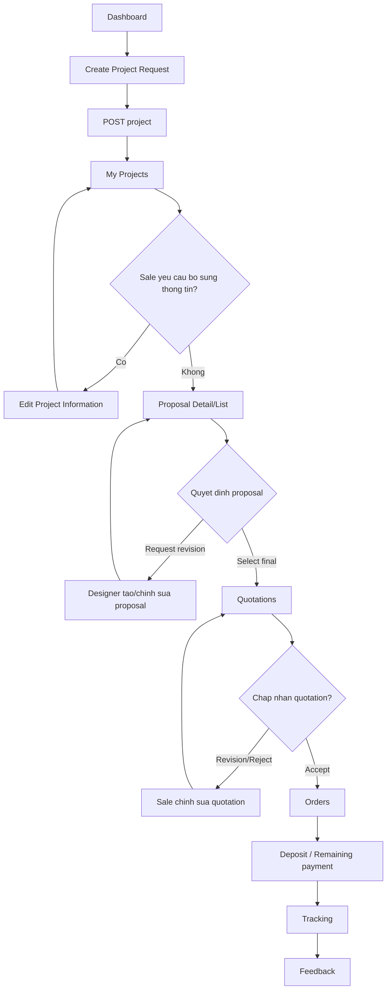

## 6. Sale workspace

Sale la nguoi tiep nhan project request, lam viec voi customer, tao lich, tao quotation va order/payment.

### 6.1 Navigation sale

| Menu | Route | Vai tro |
| --- | --- | --- |
| Dashboard | `/sales/dashbroad` | Tong quan cong viec Sale |
| Project Request Queue | `/sales/project-requests` | Hang cho request moi |
| Assigned Projects | `/sales/assigned-projects` | Project da assign cho Sale |
| Schedules | `/sales/schedules` | Quan ly lich hen |
| Quotations | `/sales/quotations` | Quan ly bao gia |
| Orders | `/sales/orders` | Quan ly order/payment |

### 6.2 Chi tiet trang sale

| Route | Trang | Chuc nang chinh |
| --- | --- | --- |
| `/sales/dashbroad` | SaleDashbroad | Tong quan project/request/quotation/order cua sale |
| `/sales/project-requests` | ProjectRequestQueue | Xem project moi status `SUBMITTED`, tim kiem, mo detail, nhan project |
| `/sales/project-requests/:projectId` | ProjectDetail | Detail project tu queue, accept/assign sale, yeu cau customer bo sung thong tin |
| `/sales/assigned-projects` | AssignedProjects | Danh sach project da duoc assign cho sale |
| `/sales/assigned-projects/:projectId` | ProjectDetail | Workspace chi tiet project cua Sale |
| `/sales/schedules` | SaleSchedules | Tao lich, cap nhat lich, reschedule/cancel/complete |
| `/sales/quotations` | SaleQuotations | Tao draft quotation, cap nhat items, gui quotation, revise |
| `/sales/orders` | SaleOrders | Tao/theo doi order, payment coc/con lai, delivery state |

Project detail cua Sale co cac tab:

| Tab | Chuc nang |
| --- | --- |
| Overview | Xem thong tin tong quan, cap nhat status, assign designer, tao project start fee payment |
| Customer Info | Xem thong tin customer va thong tin project |
| Files/Attachments | Xem file customer upload, tai lieu lien quan |
| Schedules | Tao/xem/cap nhat lich hen cua project |
| Orders | Xem order va payment lien quan |
| Chat | Trao doi trong project |

### 6.3 Flow sale

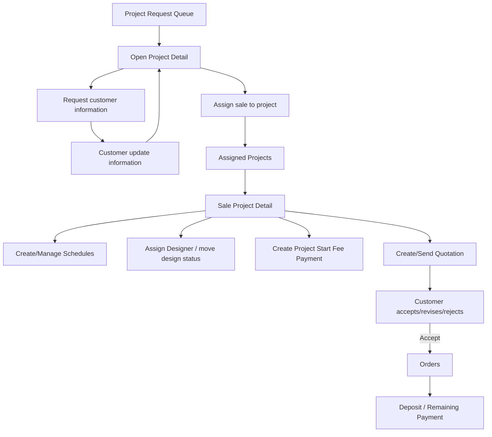

## 7. Designer workspace

Designer nhan project, tao proposal, tao scene/area, dung room planner, publish proposal cho customer va xu ly customization request.

### 7.1 Navigation designer

| Menu | Route | Vai tro |
| --- | --- | --- |
| Dashboard | `/designer/dashbroad` | Tong quan cong viec designer |
| Assigned Projects | `/designer/assigned-projects` | Project duoc giao |
| Product Library | `/designer/product-library` | Thu vien san pham/phien ban san pham |
| My Schedule | `/designer/schedules` | Lich cua designer |
| Settings | Chua co route | Dang disabled trong sidebar |

### 7.2 Chi tiet trang designer

| Route | Trang | Chuc nang chinh |
| --- | --- | --- |
| `/designer/dashbroad` | DesignerDashbroad | Tong quan project, proposal, lich |
| `/designer/assigned-projects` | DesignerAssignedProjects | Danh sach project duoc assign |
| `/designer/assigned-projects/:projectId` | DesignerProjectDetail | Workspace chi tiet project cua designer |
| `/designer/product-library` | DesignerProductLibrary | Xem product/version de dua vao proposal/scene |
| `/designer/product-library/:productId/versions/create` | DesignerCreateProductVersionPage | Tao version san pham tu workspace designer |
| `/designer/schedules` | DesignerSchedules | Xem/xac nhan lich hen lien quan |
| `/designer/projects/:projectId/proposals/new` | DesignerProposalWorkspace | Tao proposal moi |
| `/designer/projects/:projectId/proposals/:proposalId` | DesignerProposalWorkspace | Chinh sua/xem proposal workspace |
| `/proposal-scenes/:sceneId/room-planner` | BuildingThreeDTestPage | Mo room planner cho scene |
| `/proposal-scenes/:sceneId/room-planner/blueprint` | BuildingBlueprintTestPage | Mo blueprint/2D planner |
| `/proposal-scenes/:sceneId/legacy-room-planner` | ThreeDTestPage | Room planner legacy |

Designer project detail co cac tab:

| Tab | Chuc nang |
| --- | --- |
| Overview | Xem project, cap nhat design status |
| Space Files | Xem file/mat bang/tai lieu khong gian |
| Schedules | Xem/xac nhan lich |
| Project Areas | Quan ly khu vuc/khong gian cua project |
| Proposals | Tao/mo proposal, xem trang thai proposal |
| Customization | Review yeu cau customization tu customer |
| Chat | Trao doi trong project |

Designer proposal workspace co cac khu vuc chinh:

| Khu vuc | Chuc nang |
| --- | --- |
| Proposal overview | Nhap/chinh sua thong tin proposal |
| Scenes | Tao scene theo area, mo room planner |
| Proposal items | Xem/sync item tu scene, phuc vu quotation/order sau nay |
| Review & Publish | Kiem tra va publish proposal cho customer |
| Chat | Trao doi trong qua trinh lam proposal |

### 7.3 Flow designer/proposal/room planner

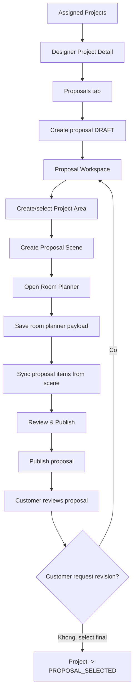

## 8. Production workspace

Production quan ly cac request lien quan san xuat, customization review, task, issue va san pham san sang giao.

### 8.1 Navigation production

| Menu | Route | Vai tro |
| --- | --- | --- |
| Dashboard | `/production/dashbroad` hoac `/production/dashboard` | Tong quan production |
| Customization Reviews | `/production/customization-reviews` | Review yeu cau customization |
| Production Requests | `/production/requests` | Danh sach yeu cau san xuat |
| My Tasks | `/production/my-tasks` | Task ca nhan |
| Blocked Issues | `/production/blocked-issues` | Van de dang block |
| Ready for Delivery | `/production/ready-for-delivery` | Hang san sang giao |
| Settings | `/production/settings` | Hien redirect ve dashboard |

### 8.2 Chi tiet trang production

| Route | Trang | Chuc nang chinh |
| --- | --- | --- |
| `/production/dashboard` | ProductionDashbroad | Tong quan tien do san xuat, request, issue |
| `/production/customization-reviews` | ProductionCustomizationRequests | Loc/xem/review customization request |
| `/production/customization-requests` | ProductionCustomizationRequests | Alias route cho customization reviews |
| `/production/requests` | ProductionRequests | Danh sach production request |
| `/production/requests/:productionRequestId` | ProductionRequestDetail | Xem detail request, items, tien do, issue/action lien quan |
| `/production/my-tasks` | MyProductionTasks | Task duoc giao cho production user |
| `/production/blocked-issues` | BlockedIssues | Danh sach issue dang chan tien do |
| `/production/ready-for-delivery` | ReadyForDelivery | Don/san pham san sang giao |

### 8.3 Flow production

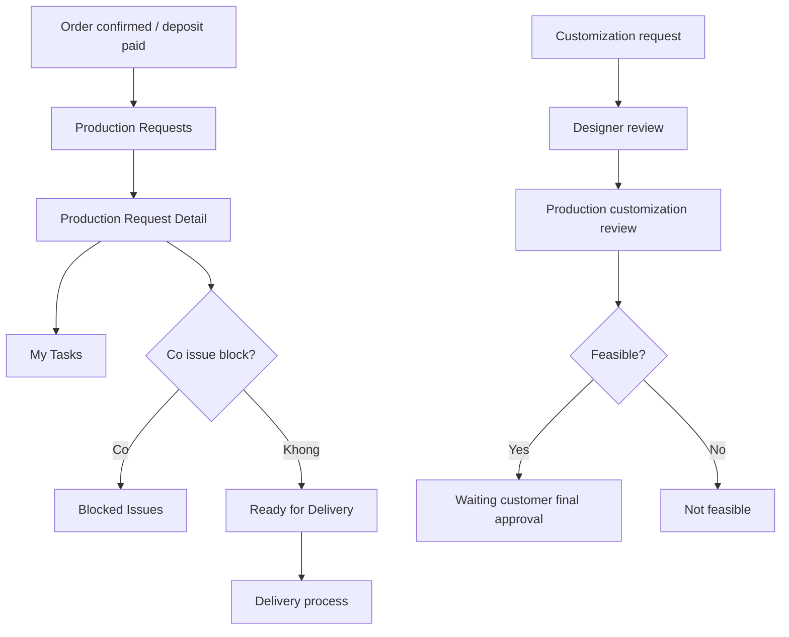

## 9. Admin workspace

Admin quan tri du lieu nen tang cua he thong: user, category, product, model/file, project va report.

### 9.1 Navigation admin

| Menu | Route | Vai tro |
| --- | --- | --- |
| Admin Dashboard | `/admin/dashbroad` | Tong quan admin |
| User & Role Management | `/admin/users` | Quan ly tai khoan/role |
| Product Categories | `/admin/categories` | Quan ly category/business type |
| Products | `/admin/products` | Quan ly product va version |
| 3D Model & File Library | `/admin/catalog/models` | Quan ly model/file cua product version |
| 3D Lab | `/admin/3d-lab` | Kiem thu 3D/model |
| Projects | `/admin/projects` | Xem/quan ly project |
| Reports | `/admin/reports` | Bao cao |

### 9.2 Chi tiet trang admin

| Route | Trang | Chuc nang chinh |
| --- | --- | --- |
| `/admin/dashbroad` | AdminDashbroad | Dashboard tong quan |
| `/admin/users` | UserManagement | Tao/cap nhat/xoa user, quan ly role/status |
| `/admin/categories` | Categorymanagement | Tao/sua category va business type |
| `/admin/products` | Productmanagement | Danh sach product, search/filter, quan ly product |
| `/admin/products/create` | CreateProductPage | Tao product moi |
| `/admin/products/:productId/versions` | ProductVersionManagement | Quan ly cac version cua product |
| `/admin/products/:productId/versions/create` | CreateProductVersionPage | Tao version moi |
| `/admin/products/:productId/versions/:productVersionId/edit` | CreateProductVersionPage | Sua version san pham |
| `/admin/catalog/models` | CatalogModelManagementPage | Quan ly model/file gan voi product version |
| `/admin/catalog/models/workspace/:productId/:productVersionId` | ProductModelWorkspacePage | Workspace upload/preview model/file cua version |
| `/admin/3d-lab` | AdminThreeDLabPage | Lab kiem thu model/3D |
| `/admin/projects` | AdminProjects | Xem danh sach/tinh trang project trong he thong |
| `/admin/reports` | AdminReports | Bao cao tong hop |

## 10. Trang 3D va Room Planner

FE co hai nhom 3D:

| Route | Muc dich |
| --- | --- |
| `/viewer3d` | Viewer demo, xem scene/model 3D |
| `/3d-lab` | Lab 3D chung |
| `/admin/3d-lab` | Lab 3D trong admin |
| `/3d-building-test` | Building room planner test |
| `/3d-building-test/blueprint` | Blueprint/2D planner test |
| `/proposal-scenes/:sceneId/room-planner` | Room planner gan voi proposal scene |
| `/proposal-scenes/:sceneId/room-planner/blueprint` | Blueprint gan voi proposal scene |
| `/proposal-scenes/:sceneId/legacy-room-planner` | Room planner cu |

Chuc nang nghiep vu cua 3D:

- Designer tao scene cho proposal.
- Room planner luu layout/phong/do noi that vao proposal scene.
- Sau khi luu scene, FE co hook sync proposal items tu scene de dua item sang proposal.
- Customer co trang 3D preview de xem phuong an da publish.
- Admin co model/catalog workspace de quan ly asset 3D dau vao.

## 11. Cac status nghiep vu chinh

### 11.1 Project status

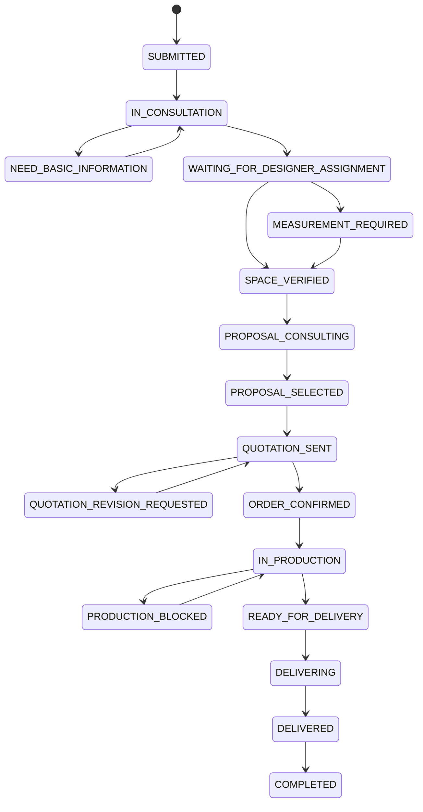

Ghi chu quan trong: theo handoff moi, giai doan proposal cua project gom trong `PROPOSAL_CONSULTING`. Project khong con nen dung project-level `PROPOSAL_DRAFTING`, `WAITING_FOR_CUSTOMER_REVIEW`, `REVISION_REQUESTED`. `REVISION_REQUESTED` la proposal-level status.

### 11.2 Proposal status

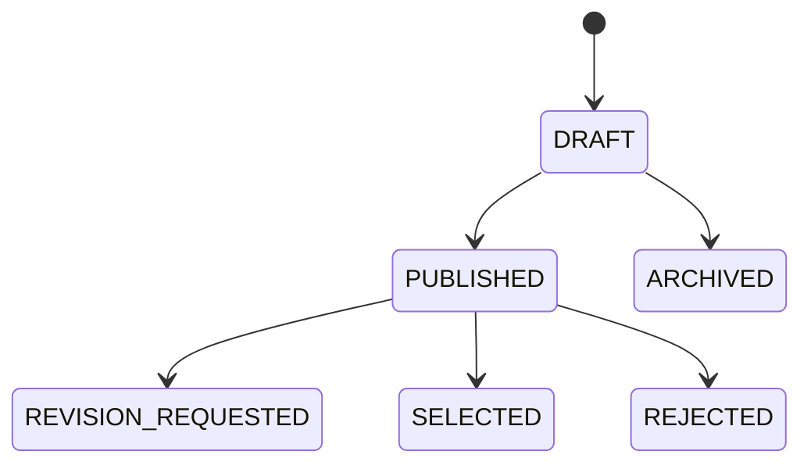

### 11.3 Quotation status

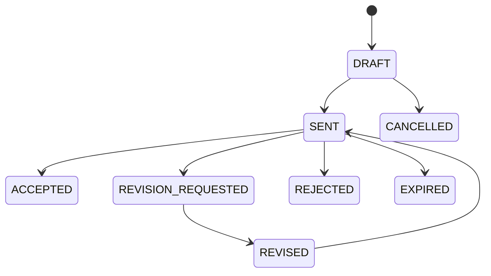

### 11.4 Order status

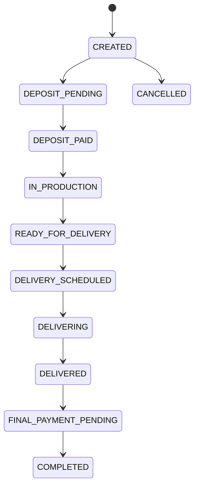

### 11.5 Schedule status

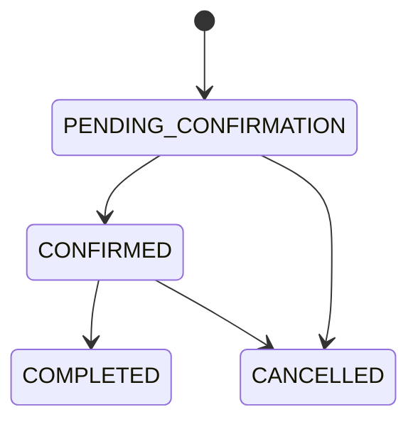

### 11.6 Customization request status

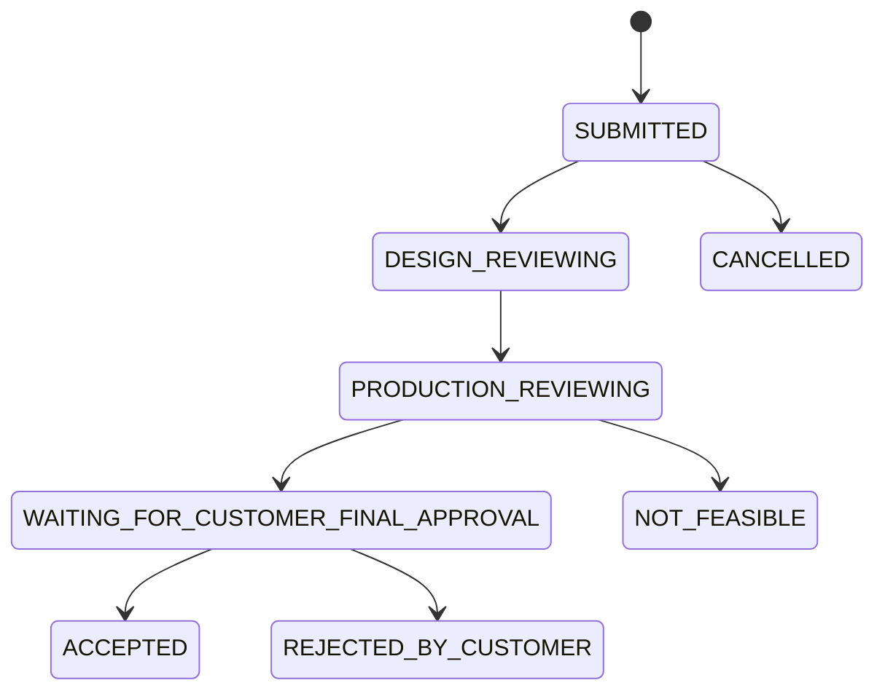

## 12. API/query layer dang duoc FE su dung

FE gom API layer trong `src/services/api/` va React Query hooks trong `src/services/queries/`.

| Domain | Hook/API chinh | Chuc nang |
| --- | --- | --- |
| Auth/Account | `useAuth`, `useAccounts` | Dang nhap, dang ky, current user, user management |
| Projects | `useProjects` | List/detail project, create project, upload files, update info/status, assign sale/designer |
| Project files/areas | `useProjectAreas`, `useProjects` | Quan ly area va file theo project |
| Schedules | `useSchedules` | Tao/xem/cap nhat/confirm schedule |
| Proposals | `useProposals` | Create/update/publish proposal, proposal items, scenes, room planner, select/revision |
| Quotations | `useQuotations` | Tao/gui/revise quotation, customer decision |
| Orders | `useOrders` | Order detail/list, deposit/remain payment, adjustment, delivery |
| Payments | `usePayments` | Project start fee, order payment, SePay QR, PayOS link, realtime payment |
| Products/Categories | `useProducts`, `useCategories`, `useBusinessTypes` | Catalog, product, product version, category |
| Production | `useProduction` | Production requests/tasks/issues/delivery |
| Customization | `useCustomizationRequests` | Customer customization, designer/production/customer review |
| Chat | `useProjectChats` | Project chat, messages, attachments, realtime |
| Notifications | `useNotifications` | Notification bell va invalidation realtime |

## 13. Realtime va notification

FE co dau hieu ho tro realtime cho:

- Payment: `usePaymentRealtime` ket noi SignalR, lang nghe `payment.updated`, cap nhat payment/order/project cache.
- Project chat: project chat hooks va chat panel dung cho customer/sale/designer.
- Notifications: notification bell va invalidation cac query lien quan.

Gia tri hub URL/API base phu thuoc `.env` va backend runtime, tai lieu nay chua xac thuc runtime backend.

## 14. Nhung diem FE dang co day du

- Da co route va workspace rieng cho 5 role chinh: Customer, Sale, Designer, Production, Admin.
- Da co public pages, auth pages, role redirect sau login.
- Da co luong project request -> sale -> designer -> proposal -> quotation -> order/payment -> production/delivery.
- Da co room planner/3D gan voi proposal scene.
- Da co payment collection component/panel/modal va realtime payment hook.
- Da co chat theo project va notification bell.
- Da co quan ly catalog/product/version/model cho admin/designer.

## 15. Nhung diem can xac nhan hoac can clean up

| Van de | Mo ta | De xuat |
| --- | --- | --- |
| Route trung lap | `App.tsx` khai bao nhieu route trong guard va lap lai ngoai guard | Clean route map, giu protected route cho role workspace |
| Ten `dashbroad` | URL hien tai sai chinh ta nhung da duoc dung rong rai | Neu doi sang `dashboard`, can them redirect tu URL cu |
| Room planner permission | Route proposal scene nam ngoai protected group | Xac nhan co can guard theo Designer/Admin/Customer preview khong |
| Designer Settings | Sidebar co Settings nhung disabled/chua co route | Xac nhan scope |
| Production Settings | Route settings redirect dashboard | Xac nhan co can trang setting rieng |
| Customer Handover | Chua thay route handover rieng | Xac nhan handover nam trong projects/tracking hay can page moi |
| Status proposal cu | Can dam bao khong con logic project-level revision cu | Ra soat theo handoff moi |
| Backend side effects | FE co mutation va invalidate cache, nhung rule status that phu thuoc BE | Can doi chieu API/BE |

## 16. Tom tat cho nguoi phu trach du an

Frontend FurniSpace hien da the hien gan nhu day du cac workspace va flow nghiep vu cot loi:

1. Khach hang tao yeu cau noi that va theo doi qua dashboard/projects/tracking.
2. Sale nhan request, tu van, tao lich, tao bao gia va order/payment.
3. Designer nhan project, tao proposal, dung room planner/3D, publish phuong an.
4. Customer xem proposal, yeu cau sua hoac chon phuong an cuoi.
5. Sale tao quotation/order, customer thanh toan coc va phan con lai.
6. Production nhan yeu cau san xuat, xu ly task/issue, chuan bi giao hang.
7. Admin quan tri user, catalog, product, model, project va report.

He thong FE dang o trang thai co nhieu man hinh va nghiep vu da duoc lap san. Viec can uu tien neu chuan bi ban giao/bao ve du an la clean route guard, xac nhan status flow voi backend, va chot scope cac trang dang disabled/redirect.
